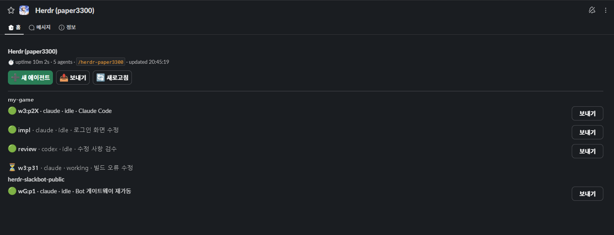
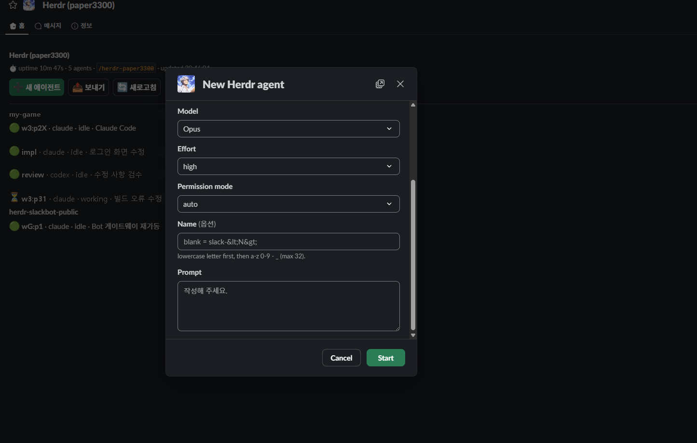
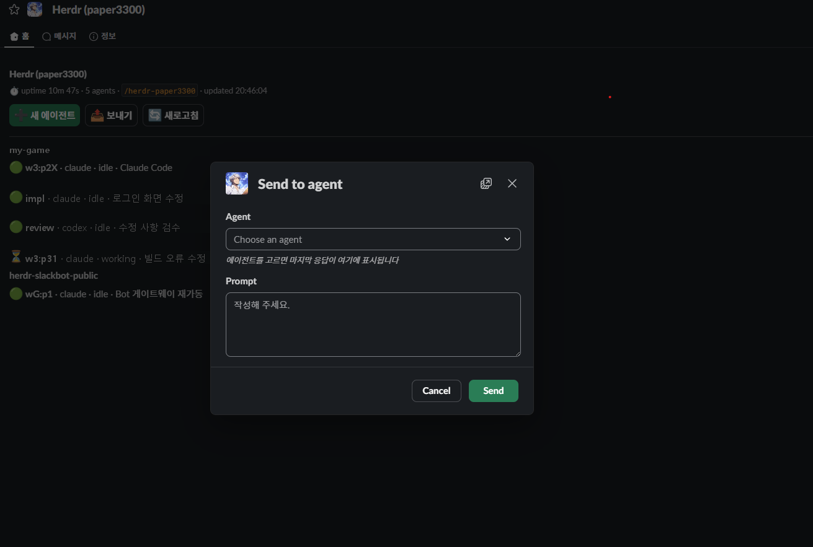

# herdr-slackbot

**English** | [한국어](README.ko.md)

[](LICENSE)


**Control the Claude Code / Codex agents running on your PC from Slack.** Get a DM when an agent finishes, answer its permission prompt with a button, and send it the next prompt, all from your phone.

<!-- Demo GIF goes here:  -->

## Why

Coding agents stop and wait all the time: a permission prompt, a question, a plan to approve. If you've stepped away from your desk, they sit idle until you come back. herdr-slackbot is a [Herdr](https://herdr.dev) plugin that connects those agents to a Slack bot DM, so you can keep them moving from anywhere.

- **Notifications:** a DM when an agent finishes (✅ done) or is waiting for an answer (⚠️ blocked), with the result text included.
- **Answer from Slack:** permission prompts, questions (AskUserQuestion) and plan approvals become **Slack buttons**.
- **Drive agents remotely:** list agents, start new ones and send prompts to running ones with a slash command or the Home tab.
- **One thread per agent:** reply in the thread and your reply goes to that agent as a prompt.
- **Private by design:** every user creates **their own Slack app**, the bot only answers **the Slack account it is paired with**, and Socket Mode means no public URL or open port.

```
Slack DM ──(Socket Mode)──> herdr-slackbot bridge ──(named pipe)──> Herdr ──> claude / codex agents
          (no public URL)     (runs in a pane of the Herdr workspace herdr-slack)
```

## Screenshots

**Home tab:** Open the bot to see the agents on your PC, grouped by workspace. Each row shows status emoji · name/pane · kind · status · terminal title. The buttons at the top start a new agent or send a prompt, and idle/done agents have their own **[Send]** button on the row.



**New agent (`/herdr new`, [➕ New Agent]):** Opens a new tab in the chosen workspace and starts an agent there. You can pick the model, effort and permission mode; the defaults are Opus · high · auto. Leave the name blank to get `slack-<N>`.



**Send (`/herdr send`, [📤 Send]):** Pick a running agent and send it a prompt. Once you pick an agent, the conversation so far (your prompts and its answers, newest at the bottom) is shown in the modal. Results come back in that agent's DM thread.



## Quick start

1. **Requirements:** Windows 10/11, **Herdr 0.8.2 or later**, **Python 3.11 or later**. Install Python first if you don't have it.

   ```powershell
   winget install Python.Python.3.12
   ```

   You also need permission to create and install apps in your Slack workspace. Workspaces managed by an admin may require approval to install apps.

2. **Install the plugin:** During install, Herdr runs `scripts/setup.ps1`, which creates the venv, installs dependencies and writes the config skeleton.

   ```powershell
   herdr plugin install paper3300/herdr-slackbot
   ```

3. **Setup wizard:** A **Slack setup** tab opens in the current workspace and runs the wizard.

   ```powershell
   herdr plugin action invoke setup --plugin herdr-slackbot
   ```

   Picking the *Slack bridge: setup wizard* action from the Herdr command palette does the same. Plugin actions cannot read input themselves (stdin is not attached), so the action opens a new tab and types the wizard command into that tab's shell.

The wizard opens Slack's create-app page with the manifest prefilled, asks for the two tokens (and checks them against Slack), starts the bridge and walks you through pairing. You can stop with Ctrl+C at any time and run it again to pick up where you left off. Details: [Setup wizard](docs/GUIDE.md#setup-wizard). Prefer to do it by hand? See [Manual setup](docs/GUIDE.md#manual-setup).

## Pairing

The bot only accepts requests from the Slack account it's paired with. When `SLACK_OWNER_USER_ID` in `.env` is empty (as on first start), the bridge shows a 6-digit code in the `herdr-slack` pane and as a Herdr notification. Open the bot from the **Apps** list in Slack's sidebar and send this in the DM:

```
/herdr-kim pair 123456
```

When "paired ✅" comes back, you're done: no restart needed, and the bot DMs you a usage guide. Code expiry, lockouts and re-pairing with another account: [Pairing details](docs/GUIDE.md#pairing-details).

## Using it in Slack

Below, `/herdr` stands for your own slash command (e.g. `/herdr-kim`). Use it in the bot DM.

| Command | What it does |
|---|---|
| `/herdr list` | List agents (by workspace, with status emoji) |
| `/herdr new` | Start a new agent from a modal: workspace, cwd, claude/codex, model, effort, permission mode, name, prompt |
| `/herdr send` | Send a prompt to an idle agent. The modal shows the conversation so far. |
| `/herdr status` | Bridge status |
| `/herdr` | Usage |

- **Threads:** each agent gets one DM thread. Replying in it sends your reply to that agent as a prompt, or as the typed answer if it is waiting on a question.
- **Notifications:** agents you started on the PC are covered too: finished work in tabs you aren't looking at, and every dialog. The 🔕 button mutes an agent.
- **Dialogs:** Claude permission prompts, AskUserQuestion (single/multiple choice, free text), plan approval, folder trust and Codex command approval all become buttons. Pressing one re-checks the screen first, so if you already answered on the PC, no keys are sent.
- **Home tab:** a dashboard of all your agents with New Agent / Send / Refresh buttons.

Full command reference, result-text rules and dialog details: [User guide](docs/GUIDE.md#using-it-in-slack).

## Security

- **Owner only:** Slash commands, buttons, modals and DM messages are handled for the single user in `SLACK_OWNER_USER_ID`. Other users who try a command get a rejection only they can see.
- **Pairing:** While the value is empty, only `/herdr pair <code>` is accepted. The code is shown only on the PC (bridge pane, Herdr notification) and never written to logs. It is a 6-digit random number compared in constant time. It is replaced after 5 wrong attempts in total or 15 minutes, and no single user can try more than 5 times in 10 minutes. Before pairing, anyone in the same workspace who knows the slash command name can attempt `pair`, so pair right after installing.
- **Code output goes to Slack.** Agent answers, the end of the screen, working folder paths and terminal titles are posted to your Slack DM. For sensitive repositories, use 🔕 mute or turn the bridge off (`stop` action).
- When starting a new agent from Slack, the only permission modes available are `manual`/`acceptEdits`/`auto`/`plan`. `bypassPermissions` is not offered.
- Tokens live only in `.env` in the plugin config folder. That file is outside the git repository, and the repo's `.gitignore` also lists `.env`. `xoxb-`/`xapp-` tokens are masked in logs.
- Socket Mode only uses outbound connections from your PC to Slack. There are no inbound ports or public URLs.

## Documentation

- [User guide](docs/GUIDE.md): setup wizard, pairing details, manual setup, start / restart, full Slack usage, troubleshooting
- [docs/LIVE_TEST.md](docs/LIVE_TEST.md): checklist for your first run against real Slack
- [docs/SPEC.md](docs/SPEC.md): design and decisions

## Development

```powershell
.venv\Scripts\python -m pip install pytest
.venv\Scripts\python -m pytest -q                       # offline tests
$env:HERDR_LIVE_TESTS=1; .venv\Scripts\python -m pytest tests/test_live.py   # against a running Herdr (read-only)
```

Design and decisions are in `docs/SPEC.md`, and per-milestone progress notes are in `docs/progress/`.

## License

[MIT](LICENSE)
